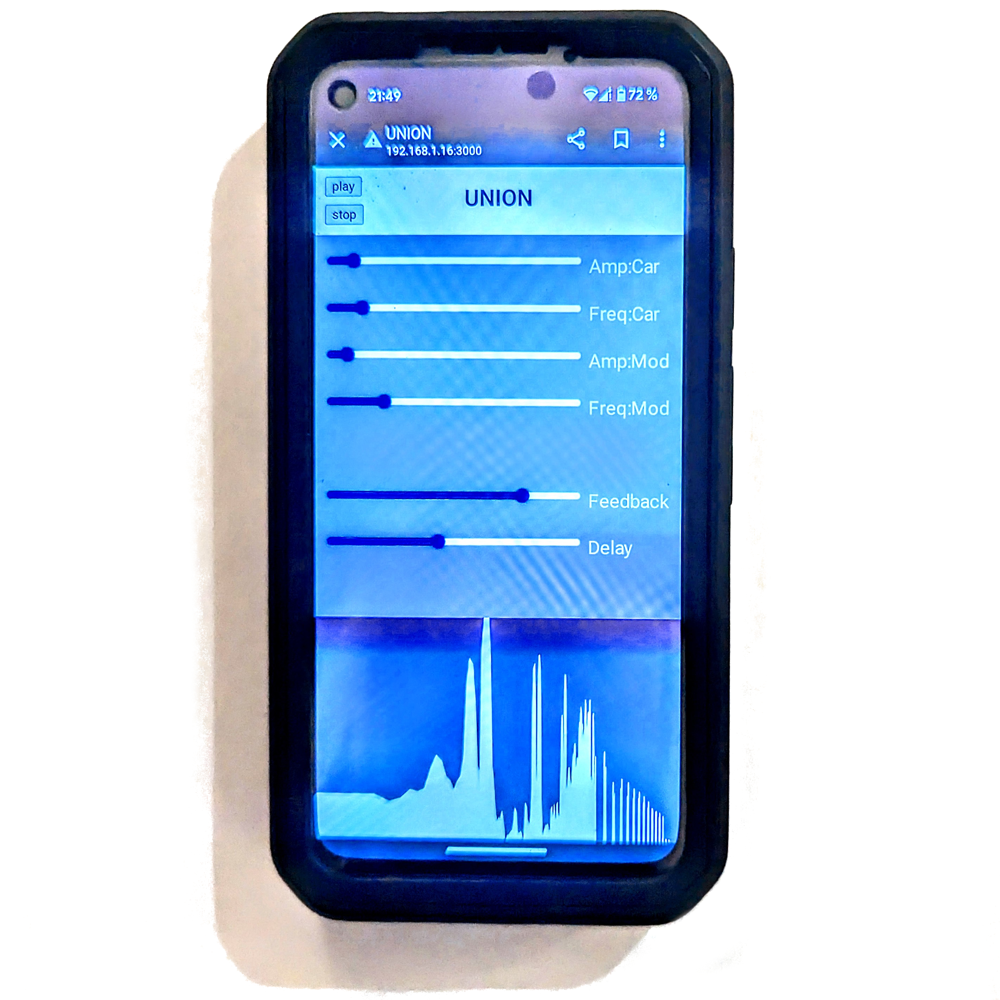

# UNION Synthesizer

UNION Synthesizer is a web-based FM synthesizer that allows users to experiment with sound design and learn about frequency modulation (FM) synthesis. The synthesizer is built with [p5js](https://p5js.org/) and includes adjustable frequency and amplitude modulation, reverb and delay effects, and a logarithmic Fast Fourier Transform (FFT) visualization for analyzing the spectrum of the generated sounds.



## Introduction

FM synthesis is a powerful technique used in electronic music to create a wide range of sounds, from bell-like tones to complex textures. However, it can be difficult to understand and master. UNION Synthesizer aims to make FM synthesis more accessible and approachable by providing a user-friendly interface and easy-to-use controls.

The synthesizer can be accessed via a web server on a smartphone, making it easy to use and experiment with wherever you are. Simply connect to the web server using the given IP address and port number, and start creating sounds!

## Features

- **FM synthesis:** Adjust the frequency and amplitude modulation of the generated sounds using sliders. This allows you to create a wide range of tones and textures, from simple sine waves to complex, evolving sounds.
- **Reverb and delay effects:** Add depth and space to your sounds with adjustable reverb and delay effects. This can help create immersive soundscapes and give your sounds a professional, polished feel.
- **FFT visualization:** The logarithmic FFT visualization allows you to see the frequency spectrum of the generated sounds in real-time. This can help you better understand the relationship between the different frequency components and how they contribute to the overall sound.

## Getting Started

To use UNION Synthesizer, follow these steps:

1. Clone the repository:

```sh
git clone https://github.com/azerty-labs/UNION-Synthesizer.git
```

2. Navigate to the `src_union` directory:

```sh
cd src_union
```

3. Install the necessary dependencies:

```sh
npm install
```

4. Start the web server:

```sh
npm run dev
```

5. Connect your smartphone to the given IP address and port number to access the synthesizer.

## License

UNION Synthesizer is licensed under the MIT License. See the `LICENSE` file for more information.

## Credits

UNION Synthesizer was created by [Your Name] using [p5js](https://p5js.org/).

## Contributing

If you'd like to contribute to UNION Synthesizer, please fork the repository and submit a pull request.